# 4.5 Alur Fungsionalitas Sistem

Penjelasan pemrosesan input menjadi output perangkingan pada Sistem Pendukung Keputusan Prioritas Perbaikan Jalan menggunakan metode AHP-SAW.

---

## 4.5.1 Alur Sistem (BPMN)

Alur sistem pada bagian ini digambarkan menggunakan notasi **Business Process Model and Notation (BPMN)** untuk memvisualisasikan proses bisnis yang terjadi dalam sistem pendukung keputusan prioritas perbaikan jalan. BPMN digunakan untuk memberikan pemahaman yang lebih jelas dan terstruktur mengenai tahapan-tahapan yang dilakukan oleh pengguna dan sistem, mulai dari proses input data hingga menghasilkan rekomendasi akhir berupa perangkingan prioritas lokasi perbaikan jalan.

### Gambar 4.3 — Alur Sistem (BPMN)

> [!TIP]
> **Cara menggunakan XML di bawah:**
> 1. Buka [draw.io](https://app.diagrams.net/) atau aplikasi draw.io desktop
> 2. Klik **Extras** → **Edit Diagram** (atau tekan `Ctrl+Shift+X`)
> 3. Hapus semua isi yang ada
> 4. Copy-paste seluruh kode XML di bawah
> 5. Klik **OK** — diagram BPMN akan langsung muncul

### Kode XML Draw.io (BPMN)

```xml
<mxfile host="app.diagrams.net" agent="BPMN-SPK-AHP-SAW" version="26.0">
  <diagram id="bpmn-spk-ahpsaw" name="Alur Sistem SPK AHP-SAW">
    <mxGraphModel dx="1800" dy="1000" grid="1" gridSize="10" guides="1" tooltips="1" connect="1" arrows="1" fold="1" page="1" pageScale="1" pageWidth="1920" pageHeight="1080" math="0" shadow="0">
      <root>
        <mxCell id="0" />
        <mxCell id="1" parent="0" />

        <!-- ═══════════════════════════════════════════════════════════ -->
        <!-- POOL: Sistem Pendukung Keputusan Prioritas Perbaikan Jalan -->
        <!-- ═══════════════════════════════════════════════════════════ -->
        <mxCell id="pool1" value="Sistem Pendukung Keputusan Prioritas Perbaikan Jalan (AHP-SAW)" style="shape=pool;startSize=30;horizontal=1;childLayout=stackLayout;horizontalStack=0;resizeParent=1;resizeParentMax=0;collapsible=0;marginBottom=0;swimlaneHead=0;fillColor=#dae8fc;strokeColor=#6c8ebf;fontStyle=1;fontSize=13;" vertex="1" parent="1">
          <mxGeometry x="30" y="30" width="1820" height="520" as="geometry" />
        </mxCell>

        <!-- LANE 1: Pengguna (Admin/Operator) -->
        <mxCell id="lane1" value="Pengguna (Admin / Operator)" style="swimlane;startSize=30;horizontal=0;fillColor=#f5f5f5;strokeColor=#666666;fontStyle=1;fontSize=11;" vertex="1" parent="pool1">
          <mxGeometry y="30" width="1820" height="260" as="geometry" />
        </mxCell>

        <!-- LANE 2: Sistem -->
        <mxCell id="lane2" value="Sistem" style="swimlane;startSize=30;horizontal=0;fillColor=#fff2cc;strokeColor=#d6b656;fontStyle=1;fontSize=11;" vertex="1" parent="pool1">
          <mxGeometry y="290" width="1820" height="230" as="geometry" />
        </mxCell>

        <!-- ═══════════════════════════════════════════════════════════ -->
        <!-- LANE 1 ELEMENTS — Pengguna                                -->
        <!-- ═══════════════════════════════════════════════════════════ -->

        <!-- Start Event -->
        <mxCell id="start" value="Mulai" style="shape=mxgraph.bpmn.shape;perimeter=mxPerimeter.ellipsePerimeter;symbol=general;isLooping=0;isSequential=0;isCompensation=0;isCall=0;isAdHoc=0;isTask=0;isCollapsed=0;outline=throwing;boundaryType=default;fillColor=#d5e8d4;strokeColor=#82b366;fontStyle=1;fontSize=10;" vertex="1" parent="lane1">
          <mxGeometry x="50" y="100" width="40" height="40" as="geometry" />
        </mxCell>

        <!-- Task: Login -->
        <mxCell id="t1" value="Login&#xa;ke Sistem" style="shape=mxgraph.bpmn.task;rectStyle=rounded;whiteSpace=wrap;taskMarker=abstract;isLooping=0;isCompensation=0;isCall=0;isAdHoc=0;isCollapsed=0;instantiate=0;fillColor=#ffffff;strokeColor=#333333;fontSize=10;fontStyle=0;" vertex="1" parent="lane1">
          <mxGeometry x="120" y="85" width="120" height="70" as="geometry" />
        </mxCell>

        <!-- Task: Masuk Beranda -->
        <mxCell id="t2" value="Masuk Halaman&#xa;Beranda" style="shape=mxgraph.bpmn.task;rectStyle=rounded;whiteSpace=wrap;taskMarker=abstract;fillColor=#ffffff;strokeColor=#333333;fontSize=10;" vertex="1" parent="lane1">
          <mxGeometry x="270" y="85" width="120" height="70" as="geometry" />
        </mxCell>

        <!-- Task: Kelola Kriteria -->
        <mxCell id="t3" value="Mengelola Kriteria&#xa;&amp; Sub-Kriteria&#xa;(CRUD)" style="shape=mxgraph.bpmn.task;rectStyle=rounded;whiteSpace=wrap;taskMarker=abstract;fillColor=#ffffff;strokeColor=#333333;fontSize=10;" vertex="1" parent="lane1">
          <mxGeometry x="420" y="85" width="140" height="70" as="geometry" />
        </mxCell>

        <!-- Task: Isi Matriks Perbandingan -->
        <mxCell id="t4" value="Mengisi Matriks&#xa;Perbandingan&#xa;Berpasangan (AHP)" style="shape=mxgraph.bpmn.task;rectStyle=rounded;whiteSpace=wrap;taskMarker=abstract;fillColor=#ffffff;strokeColor=#333333;fontSize=10;" vertex="1" parent="lane1">
          <mxGeometry x="590" y="85" width="150" height="70" as="geometry" />
        </mxCell>

        <!-- Task: Kelola Alternatif & Skor -->
        <mxCell id="t5" value="Mengelola Alternatif&#xa;(Ruas Jalan) &amp;&#xa;Mengisi Skor (1-10)" style="shape=mxgraph.bpmn.task;rectStyle=rounded;whiteSpace=wrap;taskMarker=abstract;fillColor=#ffffff;strokeColor=#333333;fontSize=10;" vertex="1" parent="lane1">
          <mxGeometry x="770" y="85" width="160" height="70" as="geometry" />
        </mxCell>

        <!-- Task: Validasi -->
        <mxCell id="t10" value="Memvalidasi&#xa;Perhitungan&#xa;(Bandingkan Manual)" style="shape=mxgraph.bpmn.task;rectStyle=rounded;whiteSpace=wrap;taskMarker=abstract;fillColor=#ffffff;strokeColor=#333333;fontSize=10;" vertex="1" parent="lane1">
          <mxGeometry x="1310" y="85" width="160" height="70" as="geometry" />
        </mxCell>

        <!-- Gateway: Sesuai? -->
        <mxCell id="gw1" value="Apakah&#xa;Perhitungan&#xa;Sesuai?" style="shape=mxgraph.bpmn.shape;perimeter=mxPerimeter.rhombusPerimeter;symbol=exclusiveGw;isLooping=0;isSequential=0;isCompensation=0;isCall=0;isAdHoc=0;isTask=0;isCollapsed=0;fillColor=#fff2cc;strokeColor=#d6b656;fontSize=9;fontStyle=0;" vertex="1" parent="lane1">
          <mxGeometry x="1510" y="90" width="60" height="60" as="geometry" />
        </mxCell>

        <!-- End Event: Selesai -->
        <mxCell id="end" value="Selesai" style="shape=mxgraph.bpmn.shape;perimeter=mxPerimeter.ellipsePerimeter;symbol=terminate;isLooping=0;isSequential=0;isCompensation=0;isCall=0;isAdHoc=0;isTask=0;isCollapsed=0;outline=end;boundaryType=default;fillColor=#f8cecc;strokeColor=#b85450;fontStyle=1;fontSize=10;" vertex="1" parent="lane1">
          <mxGeometry x="1720" y="100" width="40" height="40" as="geometry" />
        </mxCell>

        <!-- ═══════════════════════════════════════════════════════════ -->
        <!-- LANE 2 ELEMENTS — Sistem                                  -->
        <!-- ═══════════════════════════════════════════════════════════ -->

        <!-- Task: Simpan Data -->
        <mxCell id="t6" value="Menyimpan&#xa;Semua Data&#xa;yang Diinput" style="shape=mxgraph.bpmn.task;rectStyle=rounded;whiteSpace=wrap;taskMarker=abstract;fillColor=#fff2cc;strokeColor=#d6b656;fontSize=10;" vertex="1" parent="lane2">
          <mxGeometry x="830" y="80" width="140" height="70" as="geometry" />
        </mxCell>

        <!-- Task: Hitung AHP -->
        <mxCell id="t7" value="Menghitung Bobot&#xa;AHP (Kriteria,&#xa;Sub-Kriteria, Global)" style="shape=mxgraph.bpmn.task;rectStyle=rounded;whiteSpace=wrap;taskMarker=abstract;fillColor=#fff2cc;strokeColor=#d6b656;fontSize=10;" vertex="1" parent="lane2">
          <mxGeometry x="1000" y="80" width="160" height="70" as="geometry" />
        </mxCell>

        <!-- Task: Hitung SAW -->
        <mxCell id="t8" value="Melakukan Perhitungan&#xa;SAW (Normalisasi &amp;&#xa;Nilai Preferensi)" style="shape=mxgraph.bpmn.task;rectStyle=rounded;whiteSpace=wrap;taskMarker=abstract;fillColor=#fff2cc;strokeColor=#d6b656;fontSize=10;" vertex="1" parent="lane2">
          <mxGeometry x="1190" y="80" width="170" height="70" as="geometry" />
        </mxCell>

        <!-- Task: Ranking -->
        <mxCell id="t9" value="Menghasilkan&#xa;Perangkingan Prioritas&#xa;Perbaikan Jalan" style="shape=mxgraph.bpmn.task;rectStyle=rounded;whiteSpace=wrap;taskMarker=abstract;fillColor=#fff2cc;strokeColor=#d6b656;fontSize=10;" vertex="1" parent="lane2">
          <mxGeometry x="1390" y="80" width="170" height="70" as="geometry" />
        </mxCell>

        <!-- Task: Tampilkan Hasil Akhir -->
        <mxCell id="t11" value="Menampilkan&#xa;Hasil Ranking&#xa;Akhir ke Pengguna" style="shape=mxgraph.bpmn.task;rectStyle=rounded;whiteSpace=wrap;taskMarker=abstract;fillColor=#d5e8d4;strokeColor=#82b366;fontSize=10;fontStyle=1;" vertex="1" parent="lane2">
          <mxGeometry x="1600" y="80" width="160" height="70" as="geometry" />
        </mxCell>

        <!-- ═══════════════════════════════════════════════════════════ -->
        <!-- SEQUENCE FLOWS (Arrows)                                   -->
        <!-- ═══════════════════════════════════════════════════════════ -->

        <!-- Start → Login -->
        <mxCell id="f1" style="edgeStyle=orthogonalEdgeStyle;strokeColor=#333333;" edge="1" source="start" target="t1" parent="lane1">
          <mxGeometry relative="1" as="geometry" />
        </mxCell>

        <!-- Login → Beranda -->
        <mxCell id="f2" style="edgeStyle=orthogonalEdgeStyle;strokeColor=#333333;" edge="1" source="t1" target="t2" parent="lane1">
          <mxGeometry relative="1" as="geometry" />
        </mxCell>

        <!-- Beranda → Kelola Kriteria -->
        <mxCell id="f3" style="edgeStyle=orthogonalEdgeStyle;strokeColor=#333333;" edge="1" source="t2" target="t3" parent="lane1">
          <mxGeometry relative="1" as="geometry" />
        </mxCell>

        <!-- Kelola Kriteria → Matriks Perbandingan -->
        <mxCell id="f4" style="edgeStyle=orthogonalEdgeStyle;strokeColor=#333333;" edge="1" source="t3" target="t4" parent="lane1">
          <mxGeometry relative="1" as="geometry" />
        </mxCell>

        <!-- Matriks Perbandingan → Kelola Alternatif -->
        <mxCell id="f5" style="edgeStyle=orthogonalEdgeStyle;strokeColor=#333333;" edge="1" source="t4" target="t5" parent="lane1">
          <mxGeometry relative="1" as="geometry" />
        </mxCell>

        <!-- Validasi → Gateway -->
        <mxCell id="f10" style="edgeStyle=orthogonalEdgeStyle;strokeColor=#333333;" edge="1" source="t10" target="gw1" parent="lane1">
          <mxGeometry relative="1" as="geometry" />
        </mxCell>

        <!-- Gateway → Selesai (Sesuai) -->
        <mxCell id="f11" value="Sesuai" style="edgeStyle=orthogonalEdgeStyle;strokeColor=#82b366;fontStyle=1;fontSize=10;fontColor=#82b366;labelBackgroundColor=#ffffff;" edge="1" source="gw1" target="end" parent="lane1">
          <mxGeometry relative="1" as="geometry" />
        </mxCell>

        <!-- Gateway → Kembali ke Kelola Kriteria (Tidak Sesuai) -->
        <mxCell id="f12" value="Tidak Sesuai" style="edgeStyle=orthogonalEdgeStyle;strokeColor=#b85450;fontStyle=1;fontSize=10;fontColor=#b85450;labelBackgroundColor=#ffffff;exitX=0.5;exitY=0;exitDx=0;exitDy=0;entryX=0.5;entryY=0;entryDx=0;entryDy=0;" edge="1" source="gw1" target="t3" parent="lane1">
          <mxGeometry relative="1" as="geometry">
            <Array as="points">
              <mxPoint x="1540" y="40" />
              <mxPoint x="490" y="40" />
            </Array>
          </mxGeometry>
        </mxCell>

        <!-- ═══════════════════════════════════════════════════════════ -->
        <!-- CROSS-LANE FLOWS (Pengguna ↔ Sistem)                     -->
        <!-- ═══════════════════════════════════════════════════════════ -->

        <!-- Kelola Alternatif (Lane1) → Simpan Data (Lane2) -->
        <mxCell id="f6" style="edgeStyle=orthogonalEdgeStyle;strokeColor=#333333;" edge="1" source="t5" target="t6" parent="pool1">
          <mxGeometry relative="1" as="geometry" />
        </mxCell>

        <!-- Simpan Data → Hitung AHP -->
        <mxCell id="f7" style="edgeStyle=orthogonalEdgeStyle;strokeColor=#d6b656;" edge="1" source="t6" target="t7" parent="lane2">
          <mxGeometry relative="1" as="geometry" />
        </mxCell>

        <!-- Hitung AHP → Hitung SAW -->
        <mxCell id="f8" style="edgeStyle=orthogonalEdgeStyle;strokeColor=#d6b656;" edge="1" source="t7" target="t8" parent="lane2">
          <mxGeometry relative="1" as="geometry" />
        </mxCell>

        <!-- Hitung SAW → Ranking -->
        <mxCell id="f9" style="edgeStyle=orthogonalEdgeStyle;strokeColor=#d6b656;" edge="1" source="t8" target="t9" parent="lane2">
          <mxGeometry relative="1" as="geometry" />
        </mxCell>

        <!-- Ranking (Lane2) → Validasi (Lane1) -->
        <mxCell id="f9b" style="edgeStyle=orthogonalEdgeStyle;strokeColor=#333333;" edge="1" source="t9" target="t10" parent="pool1">
          <mxGeometry relative="1" as="geometry" />
        </mxCell>

        <!-- Gateway Sesuai → Tampilkan Hasil (Lane2) -->
        <mxCell id="f13" style="edgeStyle=orthogonalEdgeStyle;strokeColor=#82b366;" edge="1" source="gw1" target="t11" parent="pool1">
          <mxGeometry relative="1" as="geometry">
            <Array as="points">
              <mxPoint x="1570" y="200" />
              <mxPoint x="1570" y="405" />
            </Array>
          </mxGeometry>
        </mxCell>

        <!-- Tampilkan Hasil → End (via lane2 to end in lane1) -->
        <mxCell id="f14" style="edgeStyle=orthogonalEdgeStyle;strokeColor=#82b366;" edge="1" source="t11" target="end" parent="pool1">
          <mxGeometry relative="1" as="geometry">
            <Array as="points">
              <mxPoint x="1740" y="405" />
              <mxPoint x="1740" y="150" />
            </Array>
          </mxGeometry>
        </mxCell>

      </root>
    </mxGraphModel>
  </diagram>
</mxfile>
```

---

## 4.5.2 Penjelasan Alur Sistem

Pada alur sistem yang digambarkan dalam BPMN di atas, proses dimulai dari pengguna (**Admin** atau **Operator**) yang membuka aplikasi SPK Prioritas Perbaikan Jalan dan melakukan **login** ke sistem. Setelah berhasil masuk, pengguna akan diarahkan ke **halaman beranda (Dashboard)**, di mana ia dapat melihat ringkasan informasi proyek, jumlah kriteria, alternatif, dan status perhitungan terakhir.

### Tahap 1 — Input Data oleh Pengguna

Dari halaman beranda, pengguna dapat mengelola berbagai entitas penting dalam sistem, yaitu:

| No | Entitas | Operasi | Keterangan |
|----|---------|---------|------------|
| 1 | **Kriteria** | CRUD + Rename | Faktor Kondisi Jalan, Faktor Volume Lalu Lintas, Faktor Tata Guna Lahan |
| 2 | **Sub-Kriteria** | CRUD + Rename | Lubang-Lubang, Lenggokan/Amblas, Bahu Jalan, Kemiringan Jalan, Truk Ringan, Truk Sedang & Berat, Mobil Roda 4, Sepeda Motor, Bidang Pertanian, Bidang Pendidikan, Bidang Sosial-Budaya, Bidang Perdagangan-Jasa |
| 3 | **Matriks Perbandingan** | Input | Perbandingan berpasangan antar kriteria dan antar sub-kriteria menggunakan skala Saaty (1–9) |
| 4 | **Alternatif** | CRUD + Import | Data ruas jalan (misalnya: Jalan MT Haryono, Jalan Soekarno-Hatta, Jalan Inpres, dll.) |
| 5 | **Skor Alternatif** | Input | Nilai 1–10 pada setiap sub-kriteria untuk masing-masing alternatif (matriks keputusan X) |

Pengguna juga dapat melakukan **import data** alternatif beserta skor dari file Excel (.xlsx), CSV, atau JSON untuk mempercepat proses input data.

### Tahap 2 — Pemrosesan oleh Sistem

Setelah semua data dimasukkan, sistem akan **menyimpan data** tersebut ke dalam database. Selanjutnya, sistem secara otomatis melakukan serangkaian proses perhitungan sebagai berikut:

#### a) Perhitungan Bobot AHP (Analytic Hierarchy Process)

Sistem mengambil nilai dari **matriks perbandingan berpasangan** yang telah diisi oleh pengguna, kemudian menghitung:

1. **Bobot Kriteria Utama** — Eigen vector dari matriks perbandingan antar kriteria utama (3×3)
2. **Bobot Sub-Kriteria (Lokal)** — Eigen vector dari matriks perbandingan antar sub-kriteria dalam satu kelompok kriteria (masing-masing 4×4)
3. **Bobot Global** — Perkalian bobot kriteria × bobot lokal sub-kriteria, menghasilkan bobot akhir masing-masing sub-kriteria terhadap keseluruhan hirarki
4. **Uji Konsistensi (CR)** — Menghitung Consistency Ratio (CR) untuk setiap matriks. Jika CR ≤ 0.10, matriks dianggap konsisten. Jika tidak, pengguna perlu memperbaiki nilai perbandingan.

#### b) Perhitungan SAW (Simple Additive Weighting)

Setelah bobot global diperoleh, sistem melanjutkan perhitungan SAW:

1. **Normalisasi Matriks Keputusan** — Setiap nilai alternatif dinormalisasi berdasarkan tipe sub-kriteria:
   - *Benefit*: r_ij = x_ij / max(x_j)
   - *Cost*: r_ij = min(x_j) / x_ij
2. **Perhitungan Nilai Preferensi (V_i)** — Penjumlahan hasil perkalian nilai normalisasi dengan bobot global:
   V_i = Σ (w_j × r_ij)
3. **Perangkingan** — Alternatif diurutkan berdasarkan nilai preferensi V_i dari terbesar ke terkecil. Nilai V_i tertinggi menunjukkan alternatif dengan **prioritas perbaikan tertinggi**.

#### c) Output Perangkingan

Sistem menghasilkan output berupa **peringkat akhir** dari seluruh alternatif ruas jalan yang dinilai, lengkap dengan:
- Nilai normalisasi per sub-kriteria
- Nilai terbobot per sub-kriteria
- Nilai preferensi akhir (V_i)
- Ranking prioritas perbaikan

### Tahap 3 — Validasi oleh Pengguna

Langkah berikutnya adalah proses **validasi hasil perhitungan** oleh pengguna, di mana hasil dari sistem dibandingkan dengan **perhitungan manual** yang telah dilakukan sebelumnya (misalnya menggunakan Microsoft Excel atau SPSS). Tahap ini penting untuk memastikan akurasi dan keandalan sistem.

- **Jika hasilnya tidak sesuai** ❌: Pengguna dapat kembali memeriksa dan memperbaiki entri data, nilai perbandingan berpasangan, maupun skor alternatif yang digunakan. Alur kembali ke tahap pengelolaan kriteria.
- **Jika hasil perhitungan dianggap sesuai** ✅: Maka sistem akan menyajikan **hasil akhir** berupa peringkat rekomendasi prioritas perbaikan jalan.

### Tahap 4 — Output Akhir

Alur ini ditutup dengan proses sistem yang menyajikan **hasil akhir** kepada pengguna dalam bentuk:

1. **Tabel Perangkingan** — Daftar ruas jalan diurutkan dari prioritas tertinggi ke terendah
2. **Visualisasi Bar Chart** — Grafik batang nilai preferensi setiap alternatif
3. **Detail Perhitungan** — Matriks normalisasi, matriks terbobot, dan detail bobot AHP

Hasil ini dapat digunakan oleh pihak **Direktorat Jenderal Bina Marga — Kementerian Pekerjaan Umum** sebagai bahan pertimbangan dalam pengambilan keputusan penentuan prioritas lokasi perbaikan jalan.

---

## 4.5.3 Ringkasan Alur Proses

```mermaid
flowchart LR
    A["🟢 Mulai"] --> B["Login"]
    B --> C["Dashboard"]
    C --> D["Kelola Kriteria<br/>& Sub-Kriteria"]
    D --> E["Isi Matriks<br/>Perbandingan AHP"]
    E --> F["Kelola Alternatif<br/>& Isi Skor"]
    F --> G["💾 Simpan Data"]
    G --> H["📊 Hitung Bobot<br/>AHP + Uji CR"]
    H --> I["📐 Hitung SAW<br/>Normalisasi &<br/>Preferensi"]
    I --> J["🏆 Ranking"]
    J --> K{"Validasi:<br/>Sesuai?"}
    K -->|"✅ Ya"| L["📋 Tampilkan<br/>Hasil Akhir"]
    K -->|"❌ Tidak"| D
    L --> M["🔴 Selesai"]

    style A fill:#d5e8d4,stroke:#82b366
    style M fill:#f8cecc,stroke:#b85450
    style K fill:#fff2cc,stroke:#d6b656
    style G fill:#fff2cc,stroke:#d6b656
    style H fill:#fff2cc,stroke:#d6b656
    style I fill:#fff2cc,stroke:#d6b656
    style J fill:#fff2cc,stroke:#d6b656
    style L fill:#d5e8d4,stroke:#82b366
```



---

## 4.5.4 Keterangan Notasi BPMN

| Simbol | Nama | Keterangan |
|--------|------|------------|
| 🟢 (Lingkaran hijau) | **Start Event** | Titik awal proses — pengguna membuka aplikasi |
| 🔴 (Lingkaran merah) | **End Event** | Titik akhir proses — alur selesai |
| ▭ (Persegi panjang rounded) | **Task / Activity** | Aktivitas yang dilakukan oleh pengguna atau sistem |
| ◇ (Belah ketupat) | **Exclusive Gateway** | Titik keputusan — Ya/Tidak (fork/merge) |
| → (Panah) | **Sequence Flow** | Aliran urutan proses dari satu aktivitas ke aktivitas berikutnya |
| ═══ (Pool/Lane) | **Swimlane** | Pembagian tanggung jawab antara Pengguna dan Sistem |
| 🔴→ (Panah merah) | **Loop Back** | Alur kembali jika validasi tidak sesuai |
